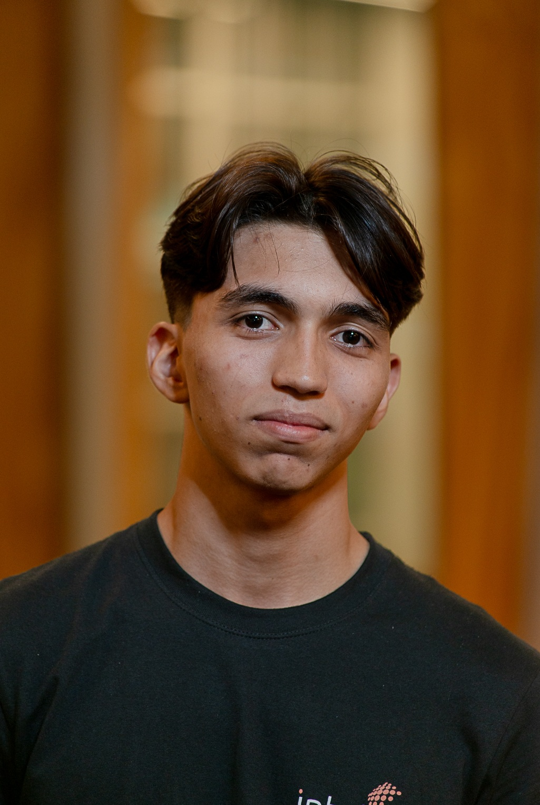

# Projeto HackCafé

## Integrante:

  <table>
    <tr>
      <td align="center"><a href="https://www.linkedin.com/in/carlosicaro/"> <b>Carlos Icaro</b></a></td>
  </table>

## Descrição

&nbsp;&nbsp;&nbsp;&nbsp;O projeto HackCafé é uma solução para o Hackathon de mesmo nome organizado pela [Café Fazenda Monthal](https://www.cafemonthal.com.br/). A solução consiste em uma plataforma Web e um dispotivio IOT que visam simplificar a vida do produtor de café de montanha por meio da captação, visualização e análise de dados da sua plantação.

&nbsp;&nbsp;&nbsp;&nbsp;A proposta insere tecnologia acessivel e escalável para o produtor rual e coloca a sua integral disposição dados criticos da sua futura colheita, dando-lhe uma visão estratégica sobre manutenção preventiva e corretiva do solo e de possiveis pragas ou anomalias em suas plantas.

&nbsp;&nbsp;&nbsp;&nbsp;O resultado é maior produtividade, redução de perdas e apoio à tomada de decisão, levando inovação à realidade do produtor rural.

## Estrutura de pastas

## Licença